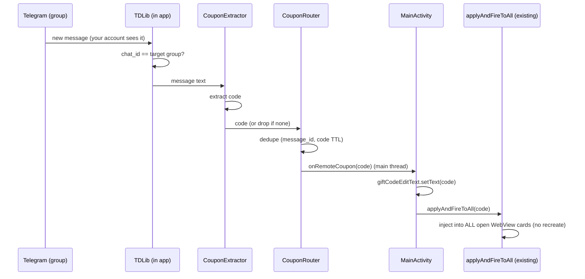
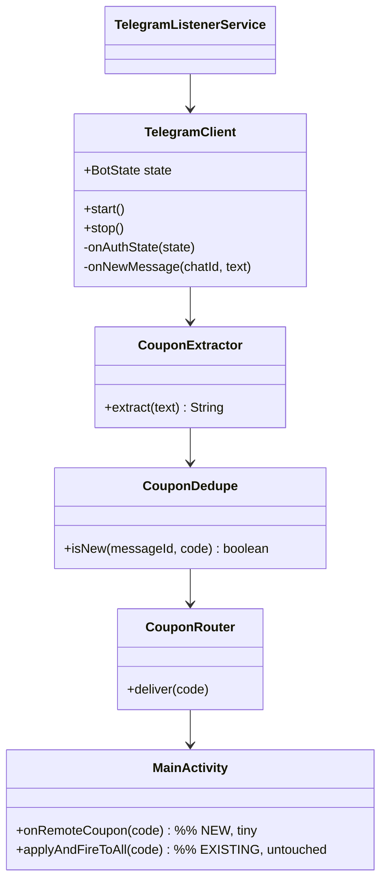

# On-Device Telegram → Auto-Claim Coupon Pipeline (NO Backend)

> **Status: design proposal for your review. No code will be written until you approve.**
> **Updated per your instruction: no backend, no server, no database.** Everything runs **inside the Android app** — it connects to Telegram directly, watches the group, detects a coupon, auto-fills the Gift Code field, and triggers your **existing** `applyAndFireToAll(...)` to claim on all open cards.
>
> Companion docs: `PROJECT_ANALYSIS.md` (current app state), `BOT_CONTROL_PLAN.md` (the Bot-API variant of this).

---

## 0. What changed from the previous version

The earlier draft proposed a Spring Boot backend (TDLib server, DB, WebSocket, broker). **All of that is removed.** This version is **100% on-device**:

| Removed (backend) | Replaced with (on-device) |
|-------------------|---------------------------|
| Spring Boot server | Nothing — logic lives in the app |
| PostgreSQL / broker | Local SharedPreferences + TDLib's own local DB |
| WebSocket / SSE / FCM delivery | Direct in-process call inside the app |
| Server-side Telegram session | **On-device Telegram client (TDLib)** logged in as you |

Trade-off: simpler, no hosting, lowest hop-count — but the Telegram session + credentials live on the phone, and detection only runs while the app is running.

---

## 1. The key constraint: how the app reads the group

To "open the group and detect the coupon," the app must read Telegram messages. There are exactly two on-device ways:

| Approach | Reads a group you only *belong to*? | What it needs | Complexity |
|----------|-------------------------------------|---------------|------------|
| **A. TDLib user client** (recommended) | ✅ Yes — logs in **as your account**, sees everything you see | `api_id`+`api_hash` from my.telegram.org, phone-number login (OTP + 2FA), bundled TDLib native library | Higher |
| **B. Bot API long-poll** | ⚠️ Only if you **add a bot to that group** (privacy mode off / admin) | A bot token; the bot must be in the group | Lower |

**Recommendation: A (TDLib).** Your words — *"open the group … my account is authorized to access"* — describe reading a group **as yourself**, which only the user-client (TDLib) can do. If the coupon group is actually one where you can **add a bot**, then **B** is dramatically simpler (pure HTTPS, no native library, no login) — see `BOT_CONTROL_PLAN.md`. This doc specifies **A** and notes B as the fallback in §14.

> ⚠️ **Honest note:** TDLib is the **official** Telegram library, so using it is legitimate. But an *automated* user account still carries some Telegram ToS risk (account bans). Use a **dedicated account with 2FA**, not your main one.

---

## 2. On-device architecture (TDLib)

```
┌───────────────────────────────────────────────────────────────────────┐
│                        CoupenApp (Android, single app)                 │
│                                                                        │
│   ┌──────────────────────────────────────────────────────────────┐    │
│   │  TelegramListenerService  (foreground service)                │    │
│   │   • hosts the TDLib client, keeps it alive in background       │    │
│   │   • shows "🟢 Telegram Connected" notification                 │    │
│   └───────────────┬──────────────────────────────────────────────┘    │
│                   │ owns                                                │
│   ┌───────────────▼──────────────┐   updateNewMessage   ┌───────────┐ │
│   │  TelegramClient (TDLib wrap)  │────────────────────► │ Coupon-   │ │
│   │   • auth state flow           │   (background thread) │ Extractor │ │
│   │   • watches target chat id    │                       └─────┬─────┘ │
│   │   • auto-reconnect (built-in) │                             │       │
│   └──────────────────────────────┘                             ▼       │
│                                                          ┌───────────┐ │
│                                                          │  Dedupe    │ │
│                                                          └─────┬─────┘ │
│                                                                │ new    │
│                                                    main thread ▼        │
│   MainActivity.onRemoteCoupon(code):                                     │
│      giftCodeEditText.setText(code)          ← populate input           │
│      applyAndFireToAll(code)  ───────────►  EXISTING, untouched          │
│                                   │ injects into ALL open WebView cards  │
│                                   ▼                                      │
│                            Betting-site cards claim the coupon           │
└───────────────────────────────────────────────────────────────────────┘
        │ MTProto (TDLib's own encrypted TCP — not affected by cleartext) │
        ▼
   Telegram servers  ◄── your account is logged in, watching the group
```

**No external services.** The only network traffic is (a) TDLib ↔ Telegram, and (b) the WebViews loading the betting sites — both already outbound-only.

---

## 3. Components (all in the app)

| Component | Responsibility |
|-----------|----------------|
| `TelegramClient` | Wraps TDLib's `Client`; drives the auth state machine; loads chats; filters `updateNewMessage` for the chosen group; exposes `start()/stop()` and a state/stat callback. TDLib handles reconnection + offline buffering itself. |
| `TelegramListenerService` | Foreground `Service` that owns `TelegramClient`, keeps it alive when backgrounded, and shows the ongoing status notification. |
| `CouponExtractor` | Message text → coupon code (regex/rules). Rejects non-coupons. |
| `CouponDedupe` | Ignores repeats by Telegram `message_id` and by last code (TTL window). |
| `CouponRouter` | On a new valid coupon, marshals to the main thread and calls `MainActivity.onRemoteCoupon(code)`. |
| `TelegramAuthActivity` | First-run login UI: phone number → OTP code → 2FA password. |
| `TelegramConfig` | Prefs: `api_id`, `api_hash`, target group (id/username), auto-start toggle, last `message_id`. |
| Bot Control panel | In `MainActivity`: Connect / Disconnect, live status card, event log, auto-start toggle (same UI as `BOT_CONTROL_PLAN.md` §5). |
| `MainActivity.onRemoteCoupon(code)` | **The single new method** — sets the input and calls existing `applyAndFireToAll`. |

---

## 4. Telegram integration (TDLib) details

**One-time developer setup (yours):**
1. Go to **https://my.telegram.org** → API development tools → create an app → get **`api_id`** and **`api_hash`**.
2. Bundle the **TDLib native library** (`libtdjni.so` for `arm64-v8a`, `armeabi-v7a`, `x86_64`) + its `org.drinkless.tdlib` Java classes into the app (built from TDLib, or a prebuilt AAR).

**First-run login flow (in `TelegramAuthActivity`), driven by TDLib's `authorizationState` updates:**
```
WaitTdlibParameters → send setTdlibParameters(api_id, api_hash, db dir, device model…)
WaitPhoneNumber     → user enters phone → setAuthenticationPhoneNumber
WaitCode            → user enters OTP   → checkAuthenticationCode
WaitPassword (2FA)  → user enters pass  → checkAuthenticationPassword
Ready               → logged in; TDLib persists an encrypted local session
```
After `Ready`, the session is stored on-device, so **subsequent launches skip login**.

**Watching the group:**
- Resolve the target chat once: by public `@username` (`searchPublicChat`) or by picking from the user's chat list (`loadChats` / `getChats`), then store its `chatId` in `TelegramConfig`.
- Listen to `updateNewMessage`; keep only messages whose `chat_id == target chatId`; pull `message.content.text`.
- Optionally `openChat(chatId)` to ensure prompt realtime delivery.

**Reliability is largely free:** TDLib maintains the connection, reconnects automatically after network loss, and queues updates while offline — so much of the "retry/backoff" work is handled by the library rather than hand-rolled.

---

## 5. Android package structure

```
app/src/main/java/com/example/coupenapp/
├─ MainActivity.java              (existing; + ONE method: onRemoteCoupon)
├─ ManageUrlActivity.java         (existing)
└─ telegram/                      (new package — isolated, additive)
   ├─ TelegramClient.java          TDLib wrapper + auth state machine
   ├─ TelegramListenerService.java Foreground service hosting the client
   ├─ TelegramAuthActivity.java    Phone / OTP / 2FA login screens
   ├─ CouponExtractor.java         text → code
   ├─ CouponDedupe.java            message_id + code TTL dedupe
   ├─ CouponRouter.java            deliver on main thread
   ├─ TelegramConfig.java          prefs (api_id, api_hash, chatId, autoStart)
   └─ BotState.java                STOPPED/CONNECTING/READY/RECONNECTING/ERROR
app/src/main/cpp or jniLibs/       TDLib native libs (libtdjni.so per ABI)
```

Existing `content.js`, `applyAndFireToAll`, `buildCoupenCommandJs`, per-card Profiles, 24h sessions — **not touched**.

---

## 6. Message flow (fully on-device)

```
1. Coupon posted in the Telegram group.
2. TDLib (running in the app) delivers updateNewMessage on its bg thread.
3. Filter: chat_id == target group?                    no → ignore.
4. CouponExtractor pulls the code from the text.       fail → ignore + log.   [#2]
5. CouponDedupe: message_id seen? code seen recently?   dup → ignore + log.    [#3]
6. CouponRouter posts to the MAIN thread.                                     [#4]
7. MainActivity.onRemoteCoupon(code):
      giftCodeEditText.setText(code)                                          [#5]
      if (webViews not empty) applyAndFireToAll(code)   ← existing            [#6,7,8]
      else log "coupon received but no cards open"
8. Event log updated with the code + timestamp.
```

**Latency:** one process, zero network hops between "detected" and "claimed" — effectively **instant** (a few milliseconds from TDLib callback to `applyAndFireToAll`, then the existing optimized fill+fire). This on-device design is actually **lower-latency than the backend one** for the claim step.

---

## 7. Coupon extraction (`CouponExtractor`)

- Trim the message; if it's a single code-like token, use it directly.
- Otherwise apply a **configurable regex** (default `\b[A-Za-z0-9]{4,20}\b`, first match) to pull the code out of a sentence like *"🎉 New code: SAVE50"*.
- Reject empty / too-short / non-matching messages (don't guess).
- **Needs your input:** please provide 2–3 real sample messages so the pattern is exact (§15, decision F).

---

## 8. Duplicate detection (2 layers, on-device)

1. **Message-level:** ignore any Telegram `message_id` already processed (persist the last id so a restart doesn't reprocess).
2. **Code-level:** ignore a `code` identical to one seen within a short TTL window (e.g., 5 min) — handles the same code reposted.

Both are tiny in-memory checks; no double-claim possible.

---

## 9. Reliability & threading

| Concern | Handling |
|---------|----------|
| Never block UI | TDLib runs its own threads; callbacks marshalled to main only for the final `onRemoteCoupon`. |
| Network drops | **TDLib auto-reconnects** and resumes; app just reflects state (RECONNECTING → READY). |
| Keep running in background | `TelegramListenerService` (foreground service) keeps the process + TDLib alive. |
| Single listener only | `TelegramClient` is a singleton; one TDLib `Client` instance; start is idempotent. |
| Clean stop | Disconnect: stop watching, `close()` the TDLib client, stop the service. |
| App killed | On relaunch, TDLib restores its session; auto-start (if enabled) resumes watching; last `message_id` prevents reprocessing. |

> **Claiming requires open cards.** Detection can run in the background, but the actual claim (`applyAndFireToAll`) needs the WebView cards to be open (and ideally the app foreground). If a coupon arrives with no cards open, it's logged, not fired — consistent with your "don't recreate WebViews" rule.

---

## 10. UI — Telegram control panel (in MainActivity)

A collapsible **Bot Control** card:
```
┌─ Telegram Auto-Claim ───────────────────────  [▾] ─┐
│  Account ....... +91 98xxxxxx21  (Connected)        │
│  Group ......... "Daily Coupons"     [ Change ]      │
│                                                     │
│  Status:  🟢 Connected — watching "Daily Coupons"   │
│  Last coupon:  SAVE50  @ 18:07:03                    │
│  Received: 12   Claimed: 11   Last error: —          │
│                                                     │
│  [ ▶ Connect ]                 [ ■ Disconnect ]      │
│  ☐ Auto-connect on app launch                        │
│                                                     │
│  ── Live Log ──────────────────────────────────    │
│  18:07:03  📩 SAVE50 detected                        │
│  18:07:03  🚀 Fired to 5 cards                       │
└─────────────────────────────────────────────────────┘
```
Status states: **Stopped / Connecting / Ready / Reconnecting / Error**. First-time **Connect** opens `TelegramAuthActivity` for phone login; afterwards it connects silently.

---

## 11. Persistence

- **TDLib local database** (on-device, encrypted) — holds the login session + message state. Managed by TDLib.
- **SharedPreferences** (`TelegramPrefs`) — `api_id`, `api_hash`, target `chatId`, `auto_start`, `last_message_id`, stat counters.

---

## 12. Security & privacy

- The **Telegram session lives on the phone** (TDLib's encrypted DB). Protect the device with a lock screen; optionally gate the panel.
- **`api_hash`** is embedded in the app (standard for Telegram clients) — keep the APK private.
- Use a **dedicated, 2FA-protected Telegram account** for automation (§1 note).
- Messages are filtered to your **target group only**; nothing else is processed.
- No data leaves the device except normal Telegram/website traffic.

---

## 13. Build / dependency notes

- Add the **TDLib native libraries** (`libtdjni.so` per ABI) + `org.drinkless.tdlib` Java classes. Options: build TDLib for Android, or use a prebuilt AAR/Maven artifact.
- **APK size** grows by a few MB per ABI (TDLib is a C++ library). Consider ABI splits.
- Re-enables the NDK/`jniLibs` path we removed earlier — but only to *bundle* the prebuilt `.so`, not to compile our own C++.
- No other third-party services or SDKs.

---

## 14. Simpler fallback: Bot API (no native lib, no login)

If the coupon group is one where **you can add a bot** (your group / you're admin), skip TDLib entirely:
- Create a bot with BotFather, add it to the group, disable its privacy mode (or make it admin) so it receives group messages.
- The app long-polls `getUpdates` over HTTPS — **no native library, no phone login, tiny footprint**.
- Everything downstream (extract → dedupe → `onRemoteCoupon` → `applyAndFireToAll`) is identical.
- Full spec: **`BOT_CONTROL_PLAN.md`**.

**Choose B if you can add a bot to the source; choose A (TDLib) if you can only read it as your own account.**

---

## 15. Sequence diagram



**ASCII:** `Telegram → TDLib(app) → extract → dedupe → onRemoteCoupon → setText + applyAndFireToAll → all cards claim`

---

## 16. UML (key classes, on-device)



---

## 17. Limitations & honest caveats

- **TDLib is a real integration effort** — bundling a native library and building a phone-login flow is the bulk of the work. If the Bot-API path (§14) is possible for your group, it is *far* less work.
- **Claiming needs open cards** and ideally the app in the foreground; background detection is fine, but the fire happens against whatever cards are currently open.
- **ToS/account risk** for automated user accounts (use a burner account + 2FA).
- The betting-site ToS/legal risk from `PROJECT_ANALYSIS.md` still applies to the claim itself.

---

## 18. Decisions to confirm before I build

| # | Decision | Options | My recommendation |
|---|----------|---------|-------------------|
| **A** | Read method | **TDLib** (read group as your account) vs **Bot API** (add a bot to the group) | **TDLib** if you can't add a bot; **Bot API** if you can (much simpler) |
| **B** | Background running | Foreground service (keeps watching in background) vs foreground-only | **Foreground service** |
| **C** | Where the panel lives | In `MainActivity` vs a separate screen | **In MainActivity** (status next to the cards) |
| **D** | **Coupon message format** | — | **Paste 2–3 real sample messages** so extraction is exact |
| **E** | Auto-connect on launch | Yes / No toggle default | Provide the toggle, default **off** |

---

### Next step
Tell me your choice for **A** (this decides the entire integration size — TDLib vs Bot API) and give me **D — sample coupon messages**. Then I'll implement the on-device pipeline in phases (connect → detect → extract/dedupe → the single `onRemoteCoupon` hook) **without touching your Apply + Fire logic**.
